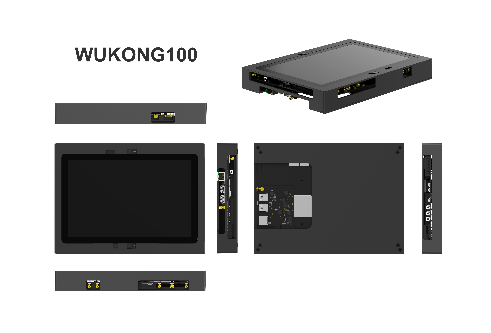
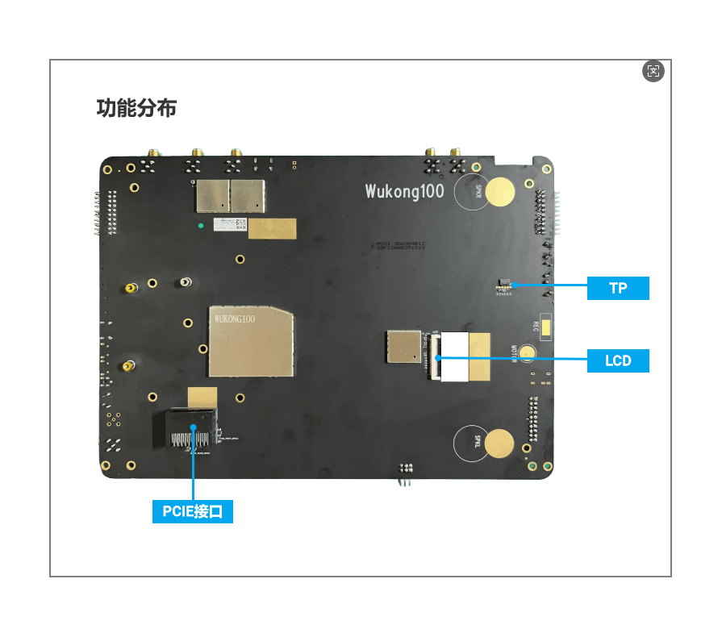
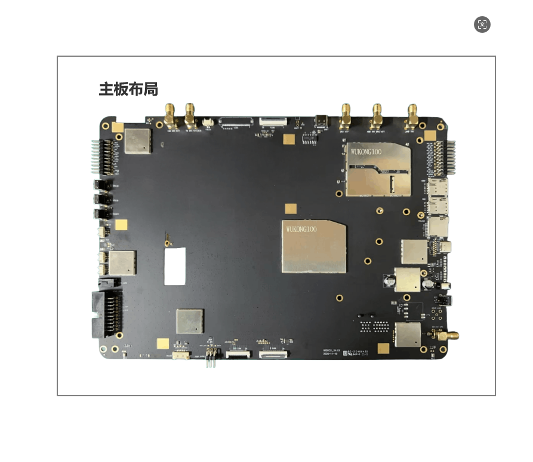
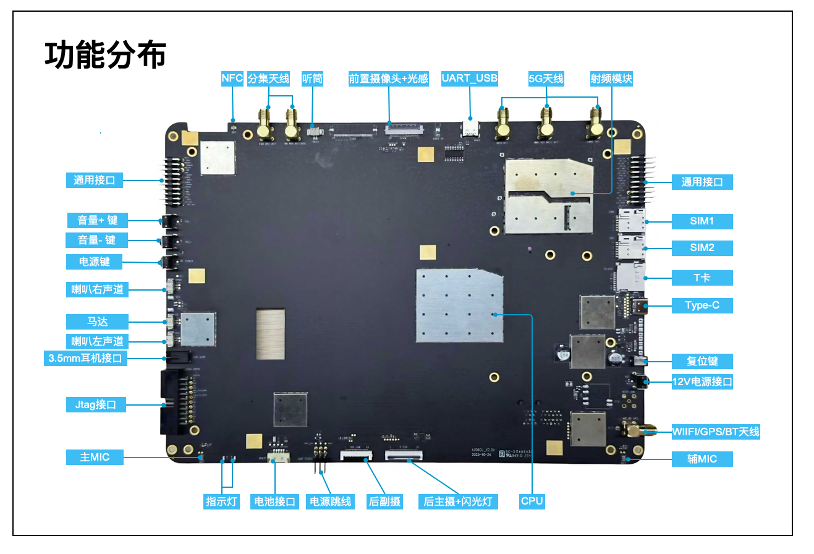

# WUKONG100 Development Kit

**Introduction**

The WUKONG100 development kit is based on UNISOC UIS7885, featuring a 1×Cortex-A76@2.7GHz + 3×Cortex-A76@2.3GHz + 4×Cortex-A55@2.1GHz architecture, Arm Mali-G57 GPU, supporting up to 4K 60fps video decoding and 4K 30fps video encoding, providing smooth 3D graphics rendering and UI animations, and supporting multi-screen HD display. It integrates an independent NPU with typical AI computing power of 4-8 TOPS, supporting mainstream deep learning frameworks. It supports 4G/5G and is compatible with LTE, WCDMA, GSM, as well as various wireless protocols such as Wi-Fi 2.4G/5.0G, Bluetooth 5.0, and NFC. It supports NearLink, GPS, GLONASS, Galileo, and BeiDou (BDS) multi-mode satellite positioning systems, has rich expansion interfaces, supports 2×UART serial ports, 20×GPIO, 2×I2C interfaces, 2×SPI interfaces, 2×ADC inputs, 2×PWM outputs, 1×I2S interface, supports headphones, configured with gigabit adaptive RJ45 Ethernet port, supports TF card, dual SIM cards, etc. Configured with 8GB memory and 256GB storage.

The appearance of the WUKONG100 development kit is shown in Figure 1:








​																						Figure 1: WUKONG100 Development Kit Appearance

**I. Development Board Details**

**1. WUKONG100 Development Kit Front Interface Diagram**



​																					Figure 2: WUKONG100 Development Kit Front Interface Diagram

**II. Development Board Specifications**

The core specifications of the WUKONG100 development kit are shown in Table 1:

| Chip, Processor, Storage |                                   |
| :----------------- | --------------------------------- |
| SoC                | UIS7885                           |
| CPU                | ARM Cortex-A76×4+ARM Cortex-A55×4 |
| GPU                | Arm Mali-G57                      |
| NPU                | 8.0TOPs                           |
| RAM                | 8GB  LPDDR4X                      |
| ROM                | 256GB UFS                         |

​																Table 1: WUKONG100 Development Kit Core Specifications

The interface specifications of the WUKONG100 development kit are shown in Table 2:

| WUKONG100 Development Kit Interface Specifications |                                                                                                                |
|------------------------------|----------------------------------------------------------------------------------------------------------------|
| Power                   | DC IN 12V3A |
| Indicator LEDs                  | 2 x PWR LED |
| Debug          | 1x UART_USB debug serial port  1x JTAG                                         |
| Buttons                   | 1xPower key, 1x Reset key, 1x Vol+/Recovery, 1 x VoL- |
| Display Interface               | 1 x  4-lane MIPI_DSI, supports TYPE-C video output (can be converted to DP or HDMI) |
| Camera Interface                   | 3x MIPI_CSI (4LANE) |
| Display Screen | 10.1 inch, FHD 1920*1200 60Hz |
| Touch Screen | Capacitive touch screen |
| USB                          | 1x TYPE-C USB3.0, 2 x USB3.0 TYPE-A HOST, supports USB camera |
| Sensor                     | 1x accel, 1x gyro, 1x als, 1x proximity, 1x magnetic |
| Motor                       | 1x linear motor                                        |
| LAN                  | 1x RJ45 Gigabit                                  |
| Cellular Data                     | 2G bands: B2/3/5/8, 3G bands: B1/2/5/8, 4G bands: B1/2/3/5/7/8/20/34/38/39/40/41, 5G bands: N1/3/5/8/28/41/77/78 |
| Wireless Network                     | Supports WIFI5 5GHz/2.4GHz,  802.11b/g/n/ac  1x antenna             |
| Bluetooth                         | BT5.0                                                        |
| NearLink                         | Supports SLE1.0 protocol                                               |
| Audio                         | 1x headphone output (3.5mm, CTIA), left and right channel SPK socket (2Pins 2W@8Ω), 2 x silicon microphone |
| SIM Card                       | 2 x SIM (Nano-SIM) supports hot-swapping                                |
| SD Card Slot                       | 1 x SD card slot, supports SDXC UHS-II                                  |
| Positioning | Supports GPS, GLONASS, Galileo, BeiDou (BDS) |
| PCIe Interface | 36-pin standard PCIe interface |
| Other Expansion Interfaces | 2 xUART serial ports, 20×GPIO, 2×I2C interfaces, 2 x SPI interfaces, 2×ADC inputs, 2×PWM outputs, 1×I2S interface |

​																	Table 2: WUKONG100 Development Kit Interface Specifications

**III. Setting Up Development Environment**

**1. Development Environment Preparation**

Operating System
•	Ubuntu 18.04 and above, X86_64 architecture, 16 GB or more memory recommended.
•	Ubuntu system username cannot contain Chinese characters.

**2. Environment Code Preparation**

**Prerequisites**

1) Register a Gitee account.

2) Register Gitee SSH public key, please refer to [Gitee Help Center](https://gitee.com/help/articles/4191).

3) Install [git client](http://git-scm.com/book/zh/v2/%E8%B5%B7%E6%AD%A5-%E5%AE%89%E8%A3%85-Git) and [git-lfs](https://gitee.com/vcs-all-in-one/git-lfs?_from=gitee_search#downloading) and configure user information.

```
git config --global user.name "yourname"

git config --global user.email "your-email-address"

git config --global credential.helper store
```

4) Install Gitee repo tool, you can execute the following command.

```
curl -s https://gitee.com/oschina/repo/raw/fork_flow/repo-py3 \>
/usr/local/bin/repo \

chmod a+x /usr/local/bin/repo

pip3 install -i https://repo.huaweicloud.com/repository/pypi/simple requests
```

**Source Code Acquisition Steps**

1) Download via repo + ssh (requires public key registration, please refer to Gitee Help Center).

```
repo init -u git@gitee.com:openharmony/manifest.git -b master --no-repo-verify

repo sync -c

repo forall -c 'git lfs pull'
```

2) Download via repo + https.

```
repo init -u https://gitee.com/openharmony/manifest.git -b master --no-repo-verify

repo sync -c

repo forall -c 'git lfs pull'
```

**Execute prebuilts**

Execute the script in the source code root directory to install the compiler and binary tools.

```
bash build/prebuilts_download.sh
```

The downloaded prebuilts binaries are stored by default in OpenHarmony_2.0_canary_prebuilts in the same directory as OpenHarmony.

**IV. Compilation and Debugging**

**1. Compilation**

Perform the following operations in the Linux environment:

1) Enter the source code root directory and execute the following command for version compilation.

*./build.sh --product-name wukong100 --ccache --gn-args make_custom_image=true*

2) Check the compilation results. After compilation is complete, the log displays:

```
post_process

=====build wukong100 successful.

2026-01-11 11:11:11
```

The files generated by compilation are archived in the out/wukong100/ directory,

Images are output in the out/wukong100/packages/phone/images/ directory.

3) After source code compilation is complete, please proceed with image flashing.

**2. Flashing Tool**

Download and use the flashing tool.

Tool path: device/board/revoview/wukong100/tools/Download_R27.22.3801.7z

Flashing instructions can be found in Download_R27.22.3801/Doc/Download Tool User Guide V4.3.pdf


